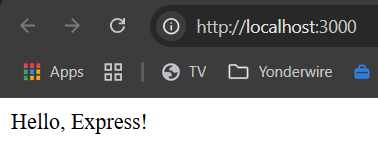

# expressjs
Sample express code

### Prereqs
- [ ] Make sure `node.js` is installed like jvm
- [ ] Express 4.x requires Node.js 0.10 or higher.
- [ ] Express 5.x requires Node.js 18 or higher.
- [ ] Test on these versions
  - npm: 10.8.3  
  - node: 18.20.4
- express.js is like springboot

### Getting Started
1. Create directory
    ```bash
        mkdir express_app
        cd express_app
    ```

2. Install Express
   - Create package.json
     ```bash
       npm init
     ```
   - Enter these options
     ```text
       package name: (express_app)
       version: (1.0.0)
       description: Express.js app sample code
       entry point: (index.js)
       test command: npm test
       git repository: https://github.com/somoruyi/expressjs.git
       keywords: express.js sample code
       author: somo
       license: (ISC) MIT
     ```
     ```bash
      npm install express
     ```
     ```bash
      npm run
     ```
     ```bash
       node index.js
     ```

3. In the browser goto localhost:3000

    